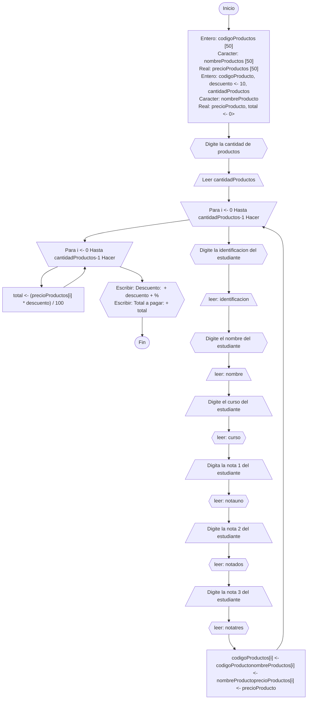

# Ejercicio base
> Juan Esteban Fonseca Avila

## Enfoque
Como empleado de una tienda de perfumes, asigna el desarrollo de una aplicación que calcule el promedio de ventas que se ha hecho durante las 4 semanas de el mes de febrero de un perfume en particular. La aplicación debe ser capaz de registrar el nombre del empleado, número de identificación, el nombre del perfume, y la cantidad de perfumes.

ACLARACIONES:
+	Se supondrá que la aplicación se necesita únicamente para calcular el promedio del mes de febrero.
+	Para mantener la simplicidad del ejemplo, no se contemplará la persistencia de datos.
+	 No se realizará validación ni se verificará la calidad de los datos ingresados.
+	Se espera que el promedio del mes sea más de $2.000.000
  

## historia de usuario
[PDF](Desktop/promediopdf.pdf)

### Descripcion
Como empelado y unico dueño de una perfumeria en la que cende (colonias AA de 100 ml), quiero poder allar
las ventas que se hizo durante 4 semanas para calcular el promedio del mes de Febrero.

Escenario  1 :
>Ingresar la informacion de los perfumes de la tienda

**Given **soy el dueño y empleado de una perfumeria****

+ Ingreso de la cantidad de perfumes que se manejan 
+ Ingreso correctamente del nombre del empleado 
+ Ingreso correctamente del numero de identificacion del empleado 

**When **seleccione la opcion calcular promedio****

**Then **Debo poder guardar la informacion del empleado:****
+ Nombre completo
+ Numero de identidicacion
+ Cantidad de perfumes
+ Valor total de la semana 1
+ Valor total de la semana 2
+ Valor total de la semana 3
+ Valor total de la semana 4

+ Promedio de las cuatro semanas 

+ Obtener promedio Total de la cantidad de perfumes manejadas

 ## Aproximacion de caso de uso 
 Nombre: Promedio venta mensual
Actores: Empleado jefe
Propósito: Guardar identificación, nombre, curso y cuatro resultados de las ventas generadas para sacar el promedio semanal.
Curso Normal de Eventos:
1. El empleado ingresa la cantidad de perfumes que se manejan 
2. El empleado ingresa la identificación, nombre, nombre de perfume, venta de la semana uno, venta de la semana dos, venta de la semana 3, venta de la semana 4. 

3. Se calcula el promedio a partir de:
(Semana 1 + semana 2+ semana 3+ semana 4/total de ventas) / Cantidad Estudiantes
4. Se Muestra el promedio de perfumes 
Postcondiciones: Promedio ventas.

## Diagrama de flujo

Desplegar

        

  
## seudocodigo   

<sunnary>Desplegar

...
Algoritmo promedio_ventas
   Definir identificaciones como cadena[50]
   Definir nombres como cadena[50]
   Definir semanauno como real[50]
   Definir semanados como real[50]
   Definir semanatres como real[50]
   Definir semanacuatro como real[50]
   Definir numeroPerfumes como entero
   Definir identificacion como cadena
   Definir nombre como cadena
   Definir semana1 como real
   Definir semana2 como real
   Definir semana3 como real
   Definir semana4 como real
   Definir promedio como real
   
   Escribir "Digite el numero de perfumes segun el menu: "
   Leer numeroPerfumes
   
   Para i = 0 Hasta numeroPerfumes Con Paso 1 Hacer
      Escribir "Digite la identificacion del empleado: "
      Leer identificacion
      Escribir "Digite el nombre del empleado: "
      Leer nombre
      Escribir "Digite la venta de la semana uno del empleado: "
      Leer semana1
      Escribir "Digite la venta de la semana dos del empleado: "
      Leer semana2
      Escribir "Digite la venta de la semana tres del empleado: "
      Leer semana3
      Escribir "Digite la venta de la semana cuatro del empleado: "
      Leer semana4
      
      identificaciones[i] <- identificacion
      nombres[i] <- nombre
      semanauno[i] <- semana1
      semanados[i] <- semana2
      semanatres[i] <- semana3
      semanacuatro[i] <- semana4
   FinPara
   
   Para i = 0 Hasta numeroPerfumes Con Paso 1 Hacer
      promedio <- promedio + ((semanauno[i] + semanados[i] + semanatres[i] + semanacuatro[i]) / 4) / numeroPerfumes
   FinPara
   
   Escribir "El promedio de ventas es: ", promedio
   

   

...

