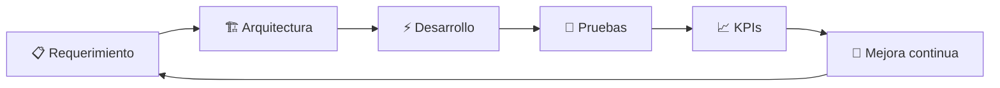

<!-- Banner superior — reemplaza la URL por tu imagen en imgur, GitHub raw, o un repo de assets -->
<div align="center">
  
</div>

<p align="center">
  <a href="https://git.io/typing-svg">
    
  </a>
</p>

<p align="center">
  
  
  
</p>

<p align="center">
  <a href="mailto:juanesavilafonc.26@gmail.com"></a>
  <a href="https://www.linkedin.com/in/TU-LINKEDIN" target="_blank"></a>
  <a href="https://wa.me/573148124180" target="_blank"></a>
</p>

---

## 👨‍💻 Sobre mí

```diff
+ Ingeniero de Software con +3 años liderando proyectos de transformación digital
+ Especializado en IA aplicada, automatización de procesos y arquitectura full-stack
+ Traduzco necesidades del negocio en soluciones técnicas con impacto medible
```

Soy **Juan Esteban Fonseca Ávila**, ingeniero de software con experiencia en el ciclo completo de iniciativas tecnológicas: desde el levantamiento de requerimientos hasta la medición de resultados con **KPIs**. Me muevo con fluidez entre equipos técnicos y funcionales, y me enfoco en entregar valor — no solo código.

> *"El mejor software es el que resuelve un problema real y se puede medir."*

---

## 🚀 Impacto en números

<table>
<tr>
<td width="25%" align="center">
  <h2>40%</h2>
  <sub>Reducción en tiempos de reportes<br/><i>Power Automate + ETL</i></sub>
</td>
<td width="25%" align="center">
  <h2>30%</h2>
  <sub>Mejora en tiempos de carga<br/><i>Optimización web móvil</i></sub>
</td>
<td width="25%" align="center">
  <h2>25%</h2>
  <sub>Incremento en conversión<br/><i>Integración Stripe + UX</i></sub>
</td>
<td width="25%" align="center">
  <h2>3+</h2>
  <sub>Años construyendo<br/><i>productos end-to-end</i></sub>
</td>
</tr>
</table>

---

## 💼 Experiencia

<details open>
<summary><b>🐄 Desarrollador Full Stack</b> — La Leyenda de San Rafael S.A.S. <code>2024 – 2026</code></summary>
<br/>

- Plataforma de **gestión ganadera full-stack** con arquitectura MVC e integración REST en tiempo real
- Dashboards interactivos con **Chart.js** y **Power BI** — pipeline completo: backend → datos → visualización
- Automatización con **Power Automate** y scripts **ETL en Python** para reportes ejecutivos
- Metodología **Scrum** con CI/CD y entregas continuas

</details>

<details>
<summary><b>🛒 Desarrollador Full Stack</b> — Byloto Store <code>Ene 2025 – May 2026</code></summary>
<br/>

- Apps web con HTML5, JavaScript, jQuery y Ajax — **−30% tiempos de carga** en móvil
- Integración **Stripe** con protocolos de seguridad — **+25% conversión**
- Componentes dinámicos en tiempo real conectados a backend **PHP**

</details>

<details>
<summary><b>📊 Consultor TI</b> — Importaciones Juank <code>Oct – Dic 2024</code></summary>
<br/>

- Dashboards dinámicos con **Power BI**, **Power Automate** y consultas SQL
- Apps **Canvas en PowerApps** para inventario con sincronización REST
- ETL con **Python + MySQL** — **−40% errores manuales**
- Control de versiones con **Git** y automatización Excel/VBA + SQL

</details>

---

## 🛠️ Stack principal

<table>
<tr>
<td valign="top" width="33%">

### Frontend


</td>
<td valign="top" width="33%">

### Backend & Data


</td>
<td valign="top" width="33%">

### Cloud & Automatización


</td>
</tr>
</table>

<details>
<summary><b>Ver stack completo</b></summary>
<br/>

| Área | Tecnologías |
|------|-------------|
| **Web** | HTML5, CSS3, JavaScript, jQuery, Ajax, Bootstrap |
| **Bases de datos** | MySQL, MariaDB, SQLite, Oracle, Supabase, Firebase |
| **APIs** | REST, Postman, Stripe |
| **Automatización** | Power Automate, PowerApps, ETL, Macros VBA |
| **DevOps** | Git, Docker, AWS, GCP, Cloudflare, Netlify |
| **Diseño** | Figma, Canva, Illustrator, Photoshop, Blender |
| **Metodologías** | Scrum, CI/CD, UAT, Pruebas funcionales e integración |

</details>

---

## 🎓 Formación

| Título | Institución | Período |
|--------|-------------|---------|
| **Ingeniería de Software** | Institución Universitaria de Colombia | 2022 – 2025 |
| **Diplomado en Ciberseguridad** | Institución Universitaria de Colombia | 2024 – 2025 |
| **Análisis de Datos con Python** (×2) | Cisco Networking Academy | 2023 |

---

## 📊 GitHub Analytics

<div align="center">


</div>

<div align="center">


</div>

<!-- Snake animation — requiere workflow en el repo juanesb2f/juanesb2f -->
<!-- <div align="center">
  
</div> -->

---

## 🏆 GitHub Trophies

<div align="center">
  
</div>

---

## 💡 Lo que me diferencia


```mermaid
graph LR
    A[📋 Requerimiento] --> B[🏗️ Arquitectura]
    B --> C[⚡ Desarrollo]
    C --> D[🧪 Pruebas]
    D --> E[📈 KPIs]
    E --> F[🔄 Mejora continua]
    F --> A
```

| Enfoque | Descripción |
|---------|-------------|
| 🎯 **Orientado a resultados** | Cada entrega se mide con métricas de negocio |
| 🤖 **IA aplicada** | Integración de IA generativa y automatización inteligente |
| 🔗 **Full cycle** | Del levantamiento de requerimientos al despliegue y monitoreo |
| 🗣️ **Puente técnico-funcional** | Comunicación clara entre equipos y stakeholders |

---

## 📬 Contacto

¿Tienes un proyecto, una idea o quieres colaborar?

<p align="center">
  <a href="mailto:juanesavilafonc.26@gmail.com">
    
  </a>
</p>

<p align="center">
  
</p>

<!-- Proudly created with ❤️ by Juan Esteban Fonseca Ávila -->
